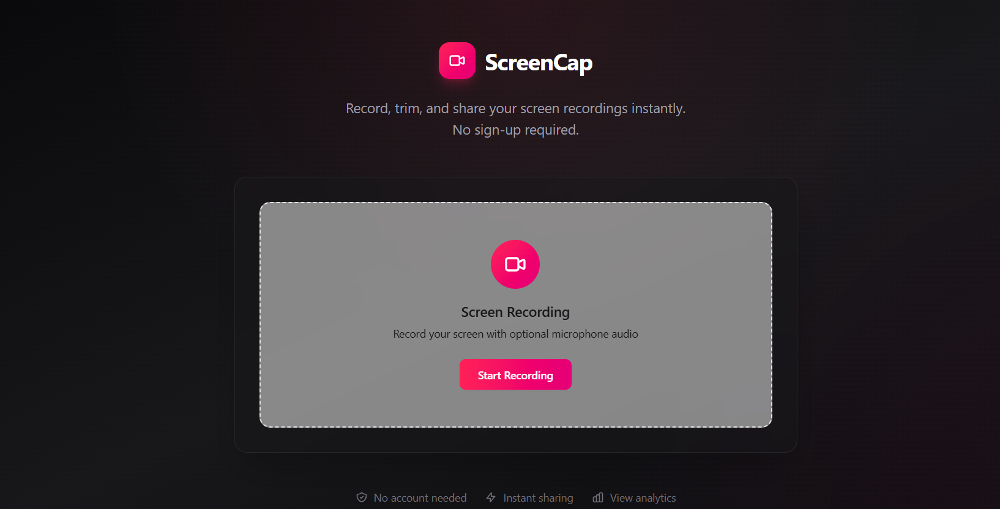
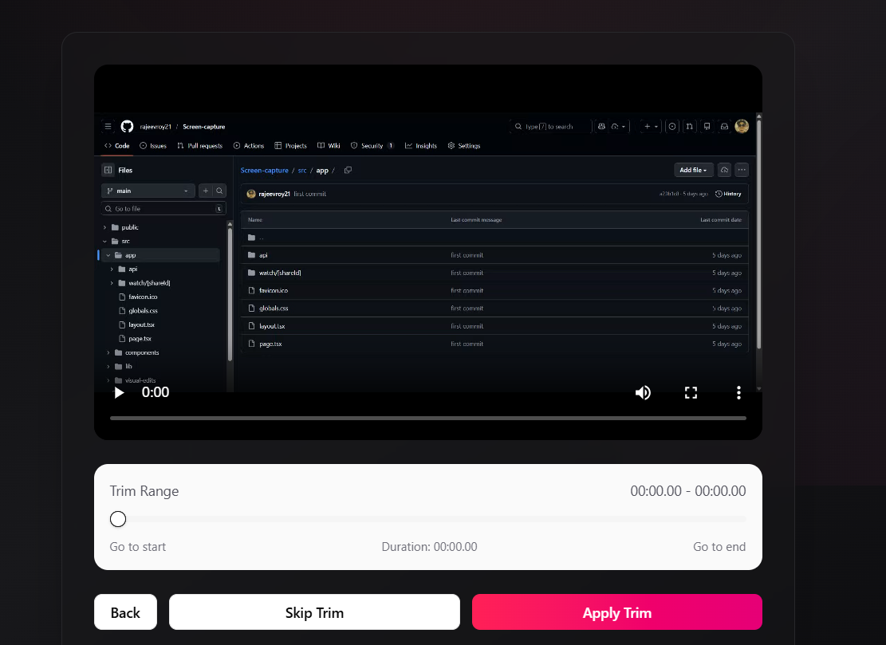
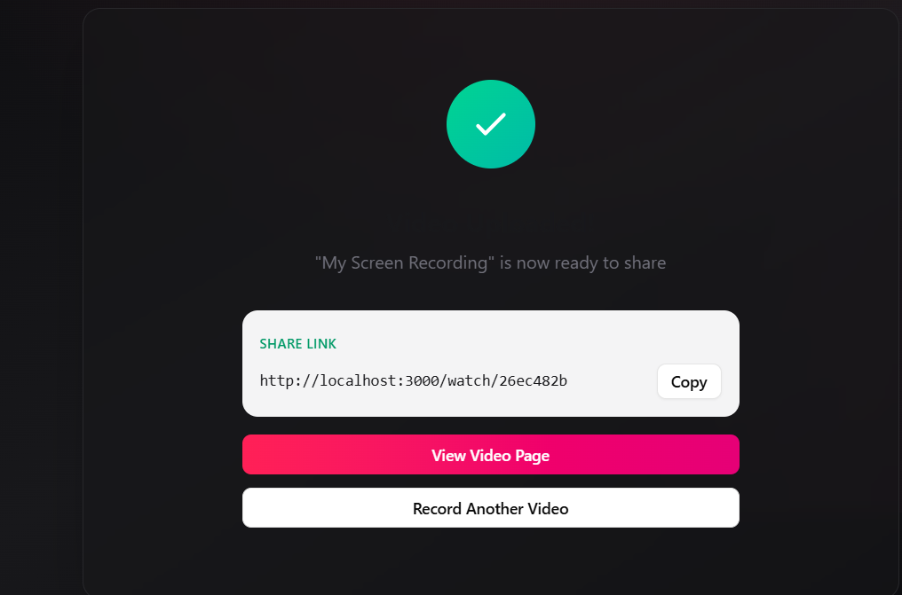

# 🎥 Screen Capture Web App

A **browser-based screen recording web application** built with **Next.js** that enables users to record, trim, store, and share screen recordings directly from the browser—no extensions required.

- **Live Demo:** https://screen-capture-xi.vercel.app 
- **Live Demo:** https://github.com/rajeevroy21/Screen-capture

---

## 🚀 Features

- 📺 Record entire screen, application window, or browser tab
- 🎙️ Optional audio recording (system/microphone)
- ⏺️ Start / stop recording with a clean and intuitive UI
- ✂️ Trim recorded videos before saving or sharing
- ☁️ Store recording metadata using Supabase
- 👁️ Track view counts for each shared video
- 🔗 Generate shareable public video links
- 🌐 Fully browser-based (no plugins or extensions)
- ⚡ Fast, lightweight, and secure

---

## 🛠️ Tech Stack

- **Frontend:** Next.js (App Router), TypeScript
- **Styling:** Tailwind Css
- **Browser APIs:** MediaDevices & MediaRecorder
- **Backend & Storage:** Supabase
- **Database:** PostgreSQL (Supabase)
- **Deployment:** Vercel

---

## 🧠 Supabase Usage

This project uses **Supabase** as the backend platform to handle:

- 📦 Storage of recording metadata (title, duration, timestamps)
- 👁️ View count tracking for shared recordings
- 🔗 Management of shareable video links
- 🗄️ PostgreSQL-based scalable database schema

